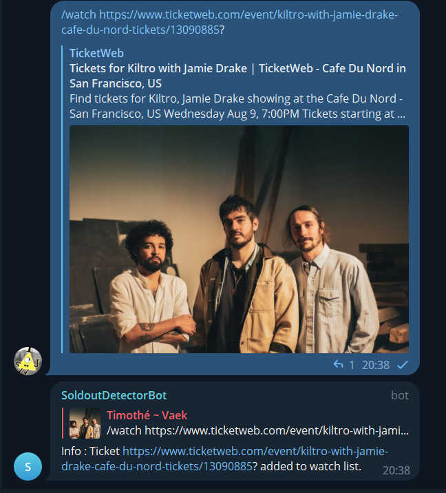
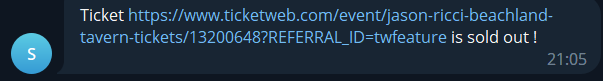

# Sold-out-Tickets-Detector
A bot to detect when tickets (festivals, concerts...) are sold out and send an alert.

You can add tickets to a watchlist.
<p align="center">
  
</p>

The bot will regularly check if any ticket in the watchlist is sold out. If so, it will send an alert to the chat ID.
<p align="center">
  
</p>

The bot runs with python. It uses the [Telegram API](https://docs.python-telegram-bot.org/en/stable/) for the bot interface, [Selenium](https://selenium-python.readthedocs.io) for web scraping and [SQlite](https://www.sqlite.org/index.html) for the database.

Currently supported ticket websites are :
- TicketWeb
- SeeTickets
- Etix

## Installation

The bot works at least on Windows 10 and 11. It is not tested on Linux.

### Prerequisites :

- git
- python (the bot works at least in version 3.9.7, probably work with other versions too)
- mozilla firefox (if you hate this browser you can try modify the function `src.web_scraping.get_driver`)
- a Telegram bot, along with its token (see https://core.telegram.org/bots#6-botfather) that is admnistrator on a chat.

Installation :
- Clone this Git repository at the location where you want the project to be, and go into it :

    ```bash
    git clone https://github.com/tboulet/Sold-out-Tickets-Detector.git
    cd Sold-out-Tickets-Detector
    ```

- Create a Telegram bot (see https://core.telegram.org/bots#6-botfather), create a group chat with it and add it as administrator. You can also use an existing group chat, but you will need to add the bot as administrator. Please not that all members of the group can interact with the bot which include adding and removing tickets from the watchlist.

- Create a file `.env` and add your credientials. An example is available in the file `.env_template` :
    ```
    BOT_TOKEN=123456789:ABCD-EFGHIJKLMNOPQRSTUV
    CHAT_ID=123456789
    ```
    You can copy paste this file, rename it `.env` and change your IDs.
    
    The bot token is given to you by @BotFather on Telegram when you create the bot.

    The chat ID is the ID of the chat where you can interact with the bot. For obtaining it, you can either try to run this bot with a dummy chat ID (such as 123456789) and try to use the bot (it will answer you the chat ID in Telegram) or use a bot such as @myidbot on Telegram.

- Create a python virtual environment for the project and activate it :

    If the 'python' command doesn't work after installing python, try 'python3' or 'py'.
    ```bash
    python -m venv venv
    venv\Scripts\activate  # use this command on windows
    source venv/bin/activate  # use this command on linux
    ```
    You should see '(venv)' at the beginning of your command line now. This means you are placed in the virtual environment used for this project. You can deactivate it with the command 'deactivate', but when you are using the project, please stay in this virtual environment.


- Install the required python libraries :
    
    ```bash
    pip install -r requirements.txt
    ```

## Usage

### Update the code
To get the latest version of the bot, you can simply pull the code from github :
```bash
git pull
```
Or, you can also execute (double click) the file `bot_update.bat` if you are on windows.

### Start the bot
For starting the bot on windows, execute the file `bot_start.bat`. This will start the bot in a new terminal window. 

For starting the bot from the CLI, simply run :
```
python run.py
```
The bot will connect to the Telegram bot, and will be ready to receive commands.

Main commands are :
- /help : list the available commands
- /watch [url1] [url2] ... : add tickets to the watchlist
- /unwatch [url1] [url2] ... : remove tickets from the watchlist
- /status : display the status of the bot
- /list : list all the tickets in the watchlist
- /check [url1] [url2] ... : check tickets status and presence in watchlist
- /reset_db : reset the database (all tickets are removed from the watchlist)

Every checking_frequency seconds (a parameter that can be modified with the /set command), the bot will check if any ticket in the watchlist is sold out. If so, it will send an alert to the chat ID.

### Closing the bot

For closing the bot, you can simply close the terminal window, or interupt the program with Ctrl+C if you want to keep your terminal open.

### Note and improvements :
- For each site, the criteria is that the url must lead to a page with a certain HTML tag that will be detected as proof of sold-out or not-sold-out. This is not verified and possibly unstable depending on the websites.
- I would like the bot to be able to have a /update command, which stop the program, pull the code from github and restart the program.
- More generally, the bot can be extended to any purpose for monitoring a certain event taking place on a website, as long as this event is detectable by a change in the HTML code.